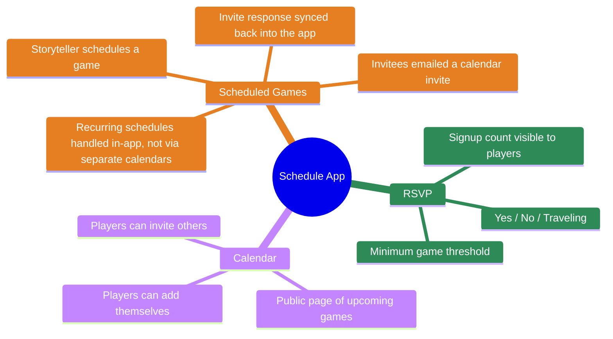
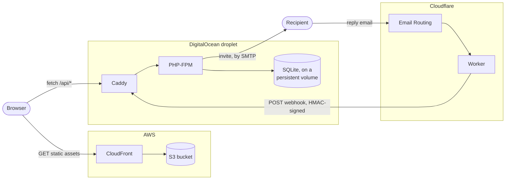
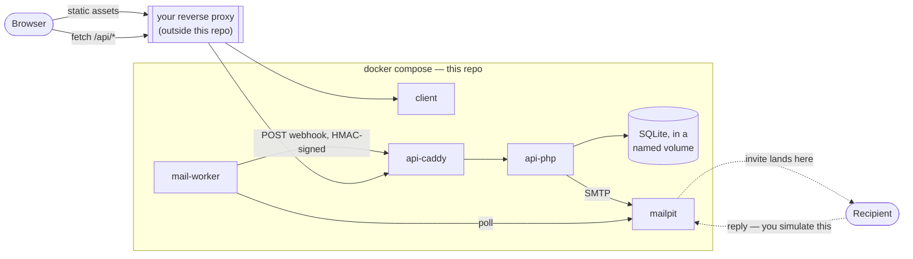

# Schedule App

This is a very simple PHP-based (backend) & JS-base (frontend) application to manage scheduling games of Blood on the
Clocktower (or BOTC).

## Features



## Architecture

- `client/` — the frontend. In prod this is built and pushed to an S3 bucket served through CloudFront; nothing here is PHP-aware.
- `api/` — a PHP-FPM API, no view rendering. In prod it runs on a small droplet behind its own Caddy, backed by SQLite on a persistent volume.
- `mail-worker/` — dev-only. Locally stands in for Cloudflare Email Routing + a Worker, which is what actually parses inbound RSVP replies and forwards them to the API's webhook in prod.

## Production flow



Cloudflare also holds DNS for the domain (not pictured) — unproxied, so `CloudFront` and the droplet each terminate their own TLS.

## Development flow



Every prod box has a local stand-in: `client` for S3 + CloudFront, `mailpit` + `mail-worker` for Cloudflare Email Routing + a Worker. There's no real recipient locally, so replying is a manual step — send a `METHOD:REPLY` message into Mailpit's SMTP port yourself to exercise that path. The reverse proxy isn't part of this repo; it's whatever gets you `https://`-style URLs pointed at the fixed ports this compose file publishes (see below).

## Development

Docker only — no PHP, Composer, or Node expected on the host.

```
docker compose up -d --build
```

This starts `client`, `api-caddy`, `api-php`, `mailpit`, and `mail-worker`, each publishing a fixed port on `127.0.0.1` (see `docker-compose.override.yml`) — 8085/8086/8087 for client/API/Mailpit respectively. This repo doesn't assume any particular local domain; if you want `https://`-style URLs instead of raw ports, point your own reverse proxy at those ports and set `RSVP_ADDRESS` in `.env` (see `.env.example`) to match whatever address you route mail to.

Once it's up, Mailpit's UI is where outbound mail the API sends shows up in dev, and it's also where you simulate an inbound RSVP reply by sending mail back into it.

### PHP dependencies

```
docker compose run --rm composer install
```

`composer.lock` is committed; `api/vendor/` is not — it's populated by the command above (dev) or baked in at image build time (prod).

### Frontend build

```
docker compose run --rm pnpm install
docker compose run --rm pnpm build
```

`client/pnpm-lock.yaml` is committed; `client/node_modules/` and `client/dist/` are not. The `client` service serves `client/dist` directly — same as the S3 bucket only ever holding the built output in prod — so re-run `pnpm build` after frontend changes to see them at `127.0.0.1:8085` (or through your reverse proxy, see above).

### Production

`docker-compose.prod.yml` is a separate override, not auto-loaded — it deliberately excludes everything dev-only (`client`, `mailpit`, `mail-worker`), since those are replaced by S3 + CloudFront and Cloudflare Email Routing + a Worker respectively. It requires `API_DOMAIN` (the hostname Caddy requests its own Let's Encrypt certificate for — see `.env.example`):

```
docker compose -f docker-compose.yml -f docker-compose.prod.yml up -d --build
```
